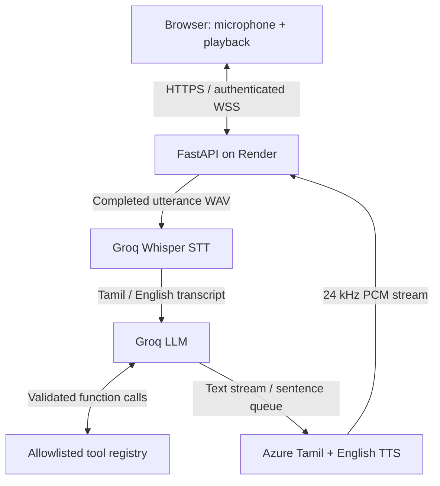

# Jarvis Cloud — private Tamil / English voice assistant

A Python 3.12 / FastAPI backend, plain HTML/CSS/JavaScript frontend, and cloud
inference. Your phone or laptop only captures and plays audio. No local GPU,
model downloads, Node build process, database, or persistent audio storage is needed.

## What this starter actually provides

- Secret-key authenticated WebSocket, exact Origin allowlist, HTTPS deployment.
- One authenticated connection per server process; eight turns/minute app limit.
- Microphone PCM streamed in approximately 43–128 ms frames, depending on device
  sample rate. AudioWorklet capture avoids deprecated ScriptProcessorNode.
- Automatic turn ending after about 850 ms of silence, or tap to finish.
- Groq multilingual Whisper transcription of each completed utterance.
- Groq LLM token streaming, short conversational history, and function calls.
- Azure Tamil/English TTS, sentence by sentence, streamed as PCM to Web Audio.
- Tamil/English recognition hints, reply-language selection, and typed Tanglish.
- Cancel stops playback, microphone capture and in-flight server tasks.
- A glowing orb responds to microphone energy; speaking uses an animated pulse.
- Bounded recording length, context, output, tool calls, queues and timeouts.
- Dockerfile, Render configuration, environment template and automated tests.

This is a **near-real-time, turn-based starter**, not a continuously listening,
full-duplex production assistant. Tap Start speaking for each turn. Automatic
silence detection ends that turn; it does not automatically restart listening.
There is no wake word, live partial STT, automatic barge-in, web search, persistent
memory, or device-changing tool. Those require additional work.

## The constraints you cannot get around

“Unlimited free,” guaranteed high Tamil/Tanglish accuracy, and reliable sub-second
responses are not a credible combined promise. Open weights do not make cloud
compute free. A free API is quota-limited and can change or disappear.

Reference checks on 2026-10-04:

| Component | Default | Limits and trade-offs |
|---|---|---|
| Hosting | Render Free web service | Sleeps after 15 minutes without inbound traffic; wake-up can take about a minute. Monthly instance-hour, bandwidth and build limits apply. |
| STT | Groq `whisper-large-v3-turbo` | Multilingual file/segment transcription, not incremental streaming STT. Current published free limits: 20 requests/minute, 2,000/day, 7,200 audio seconds/hour, 28,800/day. Account limits are authoritative. |
| LLM | Groq `openai/gpt-oss-120b` | Current published free limits: 30 requests/minute, 1,000/day, 8,000 tokens/minute, 200,000/day. A tool round can add another request. Tamil quality must be evaluated. |
| TTS | Azure Speech standard neural voices, F0 | Published free allowance: 500,000 characters/month. Also subject to request quotas and regional availability. Explicitly choose F0; a paid resource has different billing. |
| Alternative host | Hugging Face Docker Space | Current documentation says creating compute-backed Docker/Gradio Spaces requires a paid account plan, even though CPU Basic has no hourly compute charge. Do not assume it is a free hosting replacement. |

Groq currently labels Llama 3.3 70B as enterprise access. Its original supported
language list also omits Tamil. For these reasons it is not this project's default.
If a suitable Llama model is available in your own account, change
`GROQ_LLM_MODEL`; validate both provider tool support and Tamil output first.
The chosen GPT-OSS model is a practical available baseline, not a claim to have
won a Tamil benchmark. Other current multilingual models may perform better on
your own test set.

No automatic paid fallback or retry loop is included. A quota failure is shown in
the UI. Stay on the intended free tiers and review provider billing settings.

## Architecture and data flow



The arrows describe logical data flow. **FastAPI makes all provider requests**;
Groq never directly calls Azure or your devices. Provider API keys stay on the
server. The frontend and backend share one origin, avoiding a separate static
host, CORS configuration, or cookies.

1. The browser opens WSS and sends `{type: "auth", key: "..."}` as its first
   message. The key is not placed in a query string or localStorage.
2. FastAPI checks the configured Origin and key before accepting audio or text.
3. AudioWorklet encodes mono signed 16-bit little-endian PCM at the browser's
   actual AudioContext sample rate. The server wraps those bytes in a valid WAV;
   it never mislabels 48 kHz audio as 16 kHz.
4. On Stop or silence, Groq transcribes the complete utterance. The transcription
   endpoint preserves the language; the translation endpoint is not used.
5. The LLM receives the transcript and up to three recent complete turns.
6. Tokens appear immediately in chat. Complete sentences enter a bounded TTS queue
   while the LLM continues. Tamil script and Latin script are routed to different
   voices inside SSML, with XML escaping.
7. Azure returns raw 24 kHz, mono, 16-bit PCM. The browser schedules audio buffers,
   carries odd byte boundaries, and waits for playback to finish before enabling
   the next turn. This avoids microphone feedback into STT.

WebSockets were selected because the backend exchanges binary PCM and control
messages, and the upstream STT is file-based. WebRTC would add ICE/STUN/TURN and
media-server complexity without turning Whisper into a streaming STT API.

## Files

| File | Purpose |
|---|---|
| `main.py` | FastAPI, authentication, WebSocket protocol, turn lifecycle and limits |
| `providers.py` | Groq STT/LLM and Azure streaming TTS adapters |
| `config.py` | Environment configuration, required-secret validation |
| `tool_registry.py` | Validated allowlisted functions; read-only clock example |
| `static/index.html` | Auth form, voice controls and transcript |
| `static/app.js` | WebSocket client, mic lifecycle, silence detector and PCM playback |
| `static/pcm-worklet.js` | Microphone audio capture and PCM encoding |
| `static/style.css` | Responsive orb UI |
| `requirements.txt` | Runtime Python dependencies |
| `.env.example` | Configuration template with no real secrets |
| `Dockerfile` | Container for HF Spaces or another Docker host |
| `render.yaml` | Render Blueprint configuration |
| `tests/test_app.py` | Auth, framing, cancellation, limits and mocked provider tests |

Keep all these files together. `index.html` is served by FastAPI; do not open it
as a `file://` page or use VS Code Live Server on another port.

## Step 1 — Get provider credentials

### Groq

1. Open https://console.groq.com/ and create an account.
2. Create an API key. Keep it private and set `GROQ_API_KEY` in your host.
3. Check your account's model availability and Limits page. Default model IDs:
   `whisper-large-v3-turbo` and `openai/gpt-oss-120b`.
4. For error-sensitive transcription, try `whisper-large-v3` and compare your
   recordings. A larger model is not a guarantee of correct Tamil names.

### Azure Speech

1. Create an Azure account and a Speech resource in the Azure portal.
2. Select the **Free F0** pricing tier if available for your account/region. Do not
   select a paid tier expecting this application to enforce a zero-cost budget.
3. In the Speech resource's Keys and Endpoint page, copy a key and its **region
   ID**, for example `centralindia`. The region must match your actual resource.
4. Set `AZURE_SPEECH_KEY` and `AZURE_SPEECH_REGION` on the backend.
5. Defaults are `ta-IN-PallaviNeural` and `en-IN-NeerjaNeural`. Tamil male voice:
   `ta-IN-ValluvarNeural`; English male voice: `en-IN-PrabhatNeural`.
6. If a voice fails, check the region's available voices using the official
   voices-list endpoint described in the Azure REST reference. Do not use an HD
   voice assuming standard-neural F0 coverage.

Azure account creation may require identity/payment verification; availability
depends on account and region. If you cannot obtain F0, see the open-model
alternatives below. No unauthorized Microsoft Edge endpoint is used.

## Step 2 — Generate your private access key

On any machine with Python, or in a trusted cloud development terminal:

```bash
python -c "import secrets; print(secrets.token_urlsafe(32))"
```

Save the result in your password manager and use it as `APP_ACCESS_KEY`.
This key authenticates you to your own app. It is separate from both provider
API keys. Do not paste any of these secrets into GitHub, frontend JavaScript,
screenshots, or a chat conversation.

| Variable | Required | Example / meaning |
|---|---|---|
| `APP_ACCESS_KEY` | Yes | Generated random key; minimum 32 characters |
| `GROQ_API_KEY` | Yes | Groq private API key |
| `AZURE_SPEECH_KEY` | Yes | Azure Speech resource key |
| `AZURE_SPEECH_REGION` | Yes | Your actual resource region, e.g. `centralindia` |
| `ALLOWED_ORIGINS` | Yes | `https://your-actual-service.onrender.com` |
| `GROQ_LLM_MODEL` | No | `openai/gpt-oss-120b` |
| `GROQ_STT_MODEL` | No | `whisper-large-v3-turbo` |
| `TAMIL_VOICE` | No | `ta-IN-PallaviNeural` |
| `ENGLISH_VOICE` | No | `en-IN-NeerjaNeural` |

Origins are comma-separated exact `scheme://host[:port]` values, with no path.
Use your actual browser address, not an API provider URL. Never use `*`.

## Step 3 — Deploy to Render (recommended first path)

You can do this through GitHub's web interface with no local Python installation.

1. Extract this ZIP. Create a **private GitHub repository** and upload the contents
   of `jarvis-cloud/` to the repository root, including `static/`. Do not upload
   `.env`, virtual environments, recordings, or provider keys.
2. In Render, choose **New → Web Service**, connect your repository, and select
   the **Python** runtime and the **Free** instance plan if offered.
3. Set the build command:

   ```bash
   pip install -r requirements.txt
   ```

4. Set the start command:

   ```bash
   uvicorn main:app --host 0.0.0.0 --port $PORT --workers 1 --ws-max-size 16384 --ws-max-queue 8
   ```

5. Use Python 3.12; the supplied Blueprint specifies `PYTHON_VERSION=3.12.8`.
   Set the health check path to `/healthz`.
6. Add the required environment variables in Render's Environment tab. Set
   `ALLOWED_ORIGINS` to the exact assigned HTTPS Render URL. If you do not know
   the hostname until creation, set it immediately afterward and redeploy.
7. Deploy. The app refuses to start with missing credentials. A successful health
   check only means the app runs; it does not verify provider credentials.
8. Open the HTTPS URL in a normal browser tab, enter **APP_ACCESS_KEY**, click
   Connect, and allow microphone access when you start speaking.
9. First send typed text to check LLM/TTS. Then test English speech, Tamil speech,
   and mixed Tamil/English speech. Use headphones for initial tests.

Alternatively, use **New → Blueprint** and select this repository. `render.yaml`
contains the same settings and prompts for private values. Keep one worker and
one instance: the admission lock, rate limits and conversation history are
in-process. Multi-worker deployment needs shared admission/rate limiting.

Cold start is expected after inactivity. A cloud free plan is not an always-on
voice appliance. Do not use artificial keep-alive traffic to defeat provider
limits. A small paid always-on instance is the straightforward reliability upgrade.

## Step 4 — Optional VS Code development

Development needs only a small Python environment, not GPU/model storage. You can
also use a cloud IDE if you want no local installation at all.

```bash
python -m venv .venv
# Windows PowerShell:
.venv\Scripts\Activate.ps1
# macOS/Linux instead:
# source .venv/bin/activate
pip install -r requirements.txt
```

Copy `.env.example` to `.env` using VS Code and fill in the keys. Keep the supplied
localhost origins. Start:

```bash
uvicorn main:app --host 127.0.0.1 --port 8000 --workers 1 --ws-max-size 16384 --ws-max-queue 8
```

Open http://localhost:8000 in the same machine's browser. Microphone capture needs
a secure context; loopback localhost is a development exception. Accessing a LAN
IP over plain HTTP from your phone is not equivalent. Use the hosted HTTPS URL.

## Alternative deployment — Hugging Face Spaces

The included README frontmatter configures a Docker Space on port 7860.

1. Check current Spaces account eligibility and pricing. Current documentation
   requires a paid plan for creating Docker Spaces. Static Spaces cannot run this
   Python backend, and free ZeroGPU Gradio access is not an equivalent Docker host.
2. Create a Docker Space with a blank template, then upload the project files.
3. In Settings, add `APP_ACCESS_KEY`, `GROQ_API_KEY` and `AZURE_SPEECH_KEY` as
   **Secrets**. Add the region, model IDs and `ALLOWED_ORIGINS` as Variables.
4. Copy the actual application origin from the Space's direct app URL rather than
   guessing how its name maps to a subdomain. Use that origin in `ALLOWED_ORIGINS`.
5. Keep the supplied Dockerfile and `app_port: 7860`. Open the app in its direct
   tab if microphone access is blocked in Hugging Face's embedding frame.
6. Private visibility provides account-level privacy where available. For a
   public/protected app, the secret gate still protects inference, but the login
   page itself is public. Private Space authentication/browser embedding behavior
   should be checked in your account before choosing it over Render.

The container can also run on another host:

```bash
docker build -t jarvis-cloud .
docker run --rm --env-file .env -e PORT=8000 -p 8000:8000 jarvis-cloud
```

## Tamil, English and Tanglish behavior

Tanglish can mean spoken code-switching or Tamil written in Latin letters. These
are separate problems. Whisper handles speech; the LLM handles text interpretation.

- For mixed speech, start with recognition **Auto / mixed**. For a mostly Tamil
  utterance that is misrecognized, select **Tamil** and compare.
- Whisper may output Tamil script, English or mixed text. It can lose names,
  numbers or words around a language switch. The language dropdown is a hint,
  not a guarantee.
- The prompt asks the LLM to render Tamil words in Tamil script and preserve
  English words in Latin script. This is important: an English TTS voice reading
  `enna panra` is not correct Tamil pronunciation.
- The TTS adapter splits script runs and uses the corresponding voice in one SSML
  sentence. Voice changes can sound less natural than one truly bilingual voice.
- Romanized Tamil normalization depends on the LLM following the prompt. This
  starter has no separate transliteration model or validated language detector.
- Names, abbreviations and numbers may need a pronunciation lexicon. Do not route
  important device actions from an unconfirmed transcript.

Before calling the result “seamless,” record 30–50 short clips: Tamil, English and
mixed speech, your normal accent, technical words, place names and background
noise. Compare transcription accuracy, intended meaning, pronunciation, and
first audible response delay. Generic model benchmark scores are insufficient.

## Latency and bandwidth

Streaming input only reduces transport delay. Groq STT still starts after the
turn ends. End-to-end delay is the sum of silence detection, STT, first useful
LLM sentence, TTS startup, network, and the browser's 120 ms playback cushion.
Expect variable multi-second turns; this package makes no measured latency claim.
Free-host cold starts are additional. Measure on your phone and hosting region.

Input PCM uses 32–96 KB/second for the supported common sample rates. Output PCM
uses 48 KB/second (about 173 MB/hour of spoken output). This matters for host
bandwidth limits. PCM is easy to stream correctly; Opus is an efficiency upgrade
that adds encoding/decoding and transport complexity.

Tune the browser's `0.018` RMS threshold and `850` ms silence threshold for your
microphone. The detector is an energy heuristic, not a trained VAD. Background
noise may keep it open; soft speech may end it early. Maximum capture is 19 seconds
in the client and 20 seconds on the server. Use the Finish speaking button when
appropriate. Short speech is often better than long multi-topic requests.

For genuinely continuous partial transcription, replace `transcribe()` and the
turn coordinator with a supported streaming STT service, or a cloud-hosted
streaming ASR model. Keep the rest of the auth, LLM, tools and audio output design.
That upgrade changes cost and endpointing behavior; it is not included here.

## Open-model alternatives

These are alternatives to evaluate, not hidden installed dependencies:

| Need | Candidate | Practical consequence |
|---|---|---|
| Cloud CPU STT | `faster-whisper` with multilingual `small`, INT8 | The runtime supports CPU INT8. Choose multilingual models, not `.en`. Downloads and RAM live on your cloud server; latency/accuracy need testing and are unlikely to match Groq on a tiny free host. |
| Cloud Tamil TTS | Meta `facebook/mms-tts-tam` | Small VITS checkpoint (36.3M parameters). It is CC-BY-NC-4.0, not unrestricted commercial software. It needs hosted inference and its own dependencies. |
| Cloud English TTS | Separate English MMS/VITS checkpoint | Route English spans separately. Loading two models and PyTorch changes memory/startup requirements; this is not a drop-in fit for a tiny host. |

The MMS Tamil model page currently shows no hosted Inference Provider. A public
model page is not automatically a free inference API. Host it yourself in the
cloud, measure RAM/latency, and review its license if you choose that path.
For the current no-GPU/no-storage-on-your-device constraint, external official
APIs keep your backend much smaller.

## Adding IoT tools

`tool_registry.py` includes the complete function-call seam and a working
`get_server_time` example. Groq can call it, the backend validates arguments,
executes it, returns the result to the LLM, then streams the explanation.

To add a read-only sensor tool:

1. Define a Pydantic argument model with `extra="forbid"`. Use an Enum or Literal
   for allowed device IDs rather than accepting arbitrary URLs/IP addresses.
2. Write an `async` handler that calls your authenticated cloud MQTT broker or
   HTTPS device gateway with a short timeout. Keep gateway credentials server-side.
3. Register it as a `Tool` in `REGISTRY`. Its JSON Schema becomes a model tool.
4. Return structured data with timestamp/unit/status; never return credentials.
5. Test unknown IDs, stale readings, timeouts and provider errors.

Never turn an LLM output into `eval`, `exec`, a shell command, an unrestricted HTTP
request, or direct actuator permission. The registry rejects unknown names and
invalid arguments. All `mutates_device=True` tools are blocked in this starter.

For write tools later, add an authenticated confirmation message with a short-lived
server-created action ID bound to exact validated arguments. Show the device and
action in the UI, require explicit confirmation, and enforce authorization again
when executing. The LLM must not be able to approve its own action. Use idempotency
keys for repeat-sensitive commands. This confirmation flow is a future extension,
not an implemented feature.

An ESP32 on your home Wi-Fi cannot normally be reached from Render through its
private IP. Prefer the device making an outbound TLS connection to a cloud broker
or gateway. Avoid exposing unauthenticated ESP32 control endpoints to the internet.

## Security and operational boundaries

- A random shared secret makes inference private to whoever possesses that key;
  it cannot prove human identity. Protect the key and rotate it if exposed.
- The public page contains no provider keys. Authentication is enforced server-side.
- The key is sent in the first WSS message and cleared from the form afterward.
  No auth value appears in WebSocket URLs, cookies or localStorage.
- The backend uses constant-time secret comparison, a global auth-attempt window,
  origin validation, message limits and one active authenticated session.
- An Origin header is not authentication: non-browser clients can forge it. The
  secret is the credential. The global limiter is basic abuse resistance, not DDoS
  protection; an attacker may consume its slots. Stronger deployments need an
  identity-aware proxy and shared rate limiting.
- Session lifetime is one hour with a three-minute inbound-idle timeout. Re-enter
  the key after expiry/disconnection. No background keep-alive is sent.
- Audio is held in RAM for a turn. History is kept in RAM for the connection and
  disappears after disconnect/restart. App code does not intentionally log content,
  but hosting instrumentation and provider retention policies are separate.
- Providers receive audio/text. This is cloud processing, not offline privacy or
  end-to-end encryption from providers. Review their data policies for sensitive use.
- Secrets never appear in displayed provider errors. For troubleshooting, inspect
  status/limits and configuration without logging raw authorization headers/bodies.
- Cancel closes local tasks and upstream streams; it cannot undo an already
  accepted provider charge or a tool action that has already occurred.

## Validation and troubleshooting

Run the tests with synthetic/mocked provider traffic (no billable calls):

```bash
pip install pytest
python -m pytest -q
node --check static/app.js
node --check static/pcm-worklet.js
node tests/test_worklet.cjs
```

Node is only needed for optional JavaScript syntax checks. The app itself needs
no Node runtime or npm packages. If your development environment uses a SOCKS
proxy, install `httpx[socks]` in that environment.

Validation performed for this delivery: **13 Python tests passed**, both JavaScript
files passed syntax checks, and the worklet PCM encoding/flush test passed. Runtime
package versions are pinned to the versions used for those checks. One upstream
Starlette TestClient deprecation warning was emitted; it did not fail the tests.

The automated tests cover authentication rejection, origin rejection, one active
session, recording bounds, WAV/SSML generation, streamed audio, cancellation,
sanitized quota failures, allowlisted tools, and HTTP adapter payloads. They do
**not** verify real credentials, live provider inference, browser permissions,
phone audio timing, Tamil accuracy, or a deployed Render/HF service. Validate
those with your own accounts after deployment.

| Symptom | Check |
|---|---|
| App will not start | Required environment variables, Python 3.12, build/start logs |
| Access denied immediately | Correct APP_ACCESS_KEY and exact HTTPS ALLOWED_ORIGINS |
| Another session active | Disconnect the other tab/device; wait for idle expiry if it crashed |
| 401/403 provider error | Keys, Azure region, account model/voice access |
| Quota error | Groq tokens/audio/request limits; Azure F0 characters/request quotas; app's eight-turn limit |
| Model unavailable | Select a model actually available in your Groq account |
| No microphone | Browser permission, HTTPS/localhost, direct tab instead of embedded frame |
| Silence or incorrect transcript | Auto vs Tamil recognition hint, microphone level, background noise |
| Reply cuts off | Network interruption, provider limit, model output cap, or 90-second turn deadline |
| Long first connection | Render free-service cold start |
| Invalid request after backgrounding | Phone suspended the page/audio; reconnect and start a fresh turn |

## Primary documentation

- Groq STT: https://console.groq.com/docs/speech-to-text
- Groq available models: https://console.groq.com/docs/models
- Groq rate limits: https://console.groq.com/docs/rate-limits
- Azure voices: https://learn.microsoft.com/en-us/azure/ai-services/speech-service/language-support?tabs=tts
- Azure REST TTS: https://learn.microsoft.com/en-us/azure/ai-services/speech-service/rest-text-to-speech
- Azure pricing: https://azure.microsoft.com/en-us/pricing/details/speech/
- Render free plan: https://render.com/docs/free
- Hugging Face Spaces: https://huggingface.co/docs/hub/spaces-overview
- Faster Whisper: https://github.com/SYSTRAN/faster-whisper
- Tamil MMS model/license: https://huggingface.co/facebook/mms-tts-tam
- Llama 3.3 model card: https://huggingface.co/meta-llama/Llama-3.3-70B-Instruct

Provider policies, eligibility, models and quotas can change. The account dashboard
and current documentation take precedence over values recorded in this guide.
